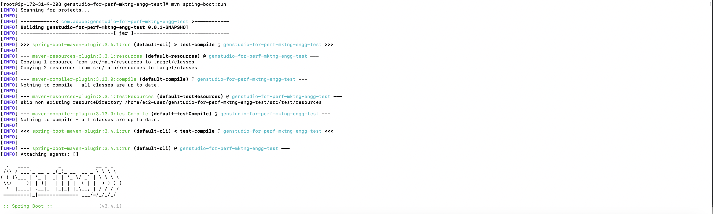
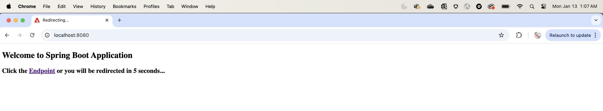
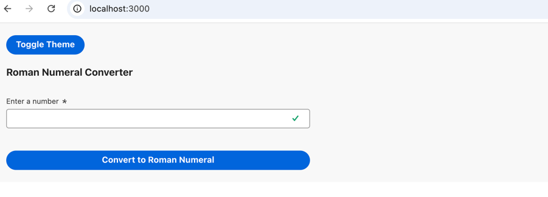
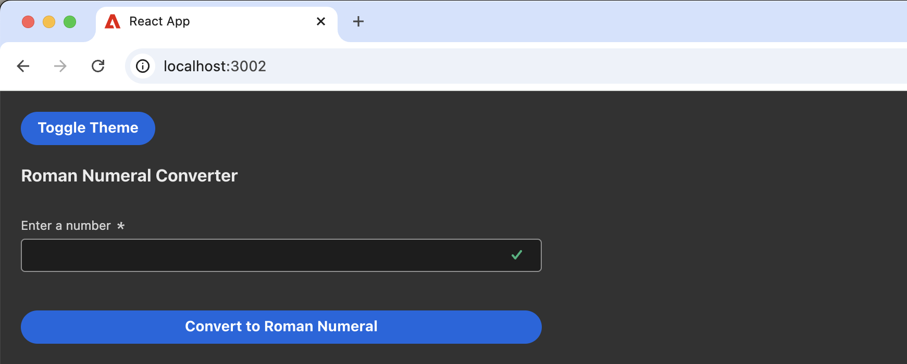

# genstudio-for-perf-mktng-engg-test

### Pre-requisites

* Java 17
* Apache Maven 3.6.3 or above
* Git

The following commands can be used to install the above softwares on a linux based machine.
  ```
  yum install java-17-openjdk
  yum install maven
  yum install git
  ```
Validate by executing the following commands

* java -version
 
  ```
  openjdk version "17.0.13" 2024-10-15 LTS
  OpenJDK Runtime Environment (Red_Hat-17.0.13.0.11-1) (build 17.0.13+11-LTS)
  OpenJDK 64-Bit Server VM (Red_Hat-17.0.13.0.11-1) (build 17.0.13+11-LTS, mixed mode, sharing)
  ```

* mvn -version
  ```
  Maven home: /usr/share/maven
  Java version: 17.0.13, vendor: Red Hat, Inc., runtime: /usr/lib/jvm/java-17-openjdk-17.0.13.0.11-4.el9.x86_64
  Default locale: en_US, platform encoding: UTF-8
  OS name: "linux", version: "5.14.0-503.15.1.el9_5.x86_64", arch: "amd64", family: "unix"
  ```
  
*  git -v
  ```
  git version 2.43.5
```

### Clone the git repository
  ```
  git clone https://github.com/arpithaar/genstudio-for-perf-mktng-engg-test.git
  ```

### Project installation

* Navigate to the folder genstudio-for-perf-mktng-engg-test from a terminal and execute the below command to run the Spring boot application
    ```
  mvn clean install
  mvn spring-boot:run
    ```

* Below logs can be seen in the terminal


* Above command will initialize Tomcat server on port 8080 and deploy the spring boot application
* Navigate to http://localhost:8080/ to ensure server is running
  
* Access the REST endpoint in the following format - http://localhost:8080/romannumeral?query=3432

* Navigate to the folder react-frontend in a different terminal. Install npm using the following command
  ```
  yum install npm -y
  ```
* Validate npm using the following command
  ```
  npm -v
  ```
* Install libraries needed for the react app
  ```
  npm install
  ```
  
* Once the above command is successful, node_modules folder will be created for all the downloaded libraries.
* Run the react frontend using the below command
  ```
  npm start
  ```
* The frontend application will now be accessible via http://localhost:3000/
* Light Theme:
  
* Dark Theme:
  

### Framework Dependencies
* Using Spring Boot 3 as the Java backend to create the REST endpoint as it comes with embedded Tomcat server
* Spring Boot 3 is only supported from Java 17 onwards to support optimization benefits
* Created spring boot project using Spring Initializr https://start.spring.io/
* Added Spring Web dependency in pom.xml for creating REST endpoints
```
    <dependency>
        <groupId>org.springframework.boot</groupId>
        <artifactId>spring-boot-starter-web</artifactId>
    </dependency>
```
* Added ThymeLeaf dependency for dynamic templating in HTML
  ```
    <dependency>
			<groupId>org.springframework.boot</groupId>
			<artifactId>spring-boot-starter-thymeleaf</artifactId>
		</dependency>
  ```
  
* Configured Logback in Spring. Configuration file placed at src/main/resources/logback-spring.xml
* React App for the frontend
* Bootstrapped a react app using the command
    ```
    npx create-react-app react-frontend
    ```
* Using Axios in React to invoke http requests to Spring Boot application
* React Spectrum libraries to leverage Adobe's design system


### Logic to convert integer to roman
1. Divide the given number into digits at different places like one’s, two’s, hundred’s or thousand’s.
2. Starting from the thousand's place, print the corresponding roman value. For example, if the digit at thousand’s place is 3 then print the roman equivalent of 3000.
3. Repeat the second step until we reach one’s place.