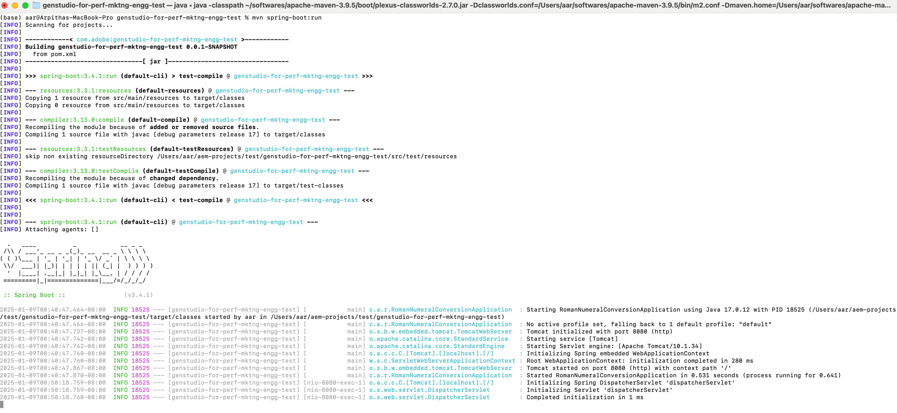
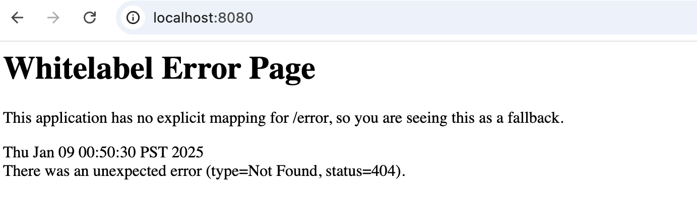
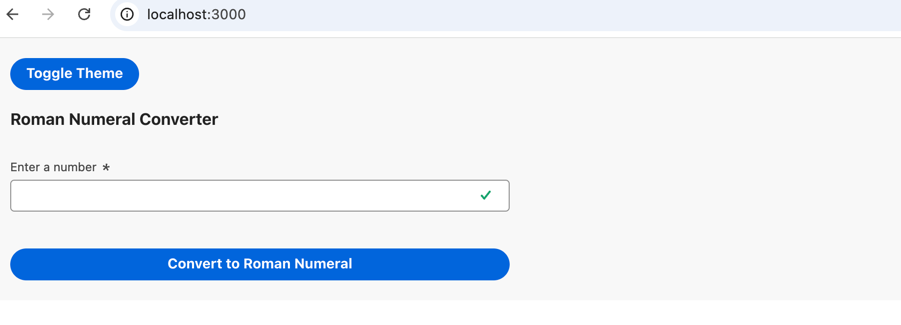
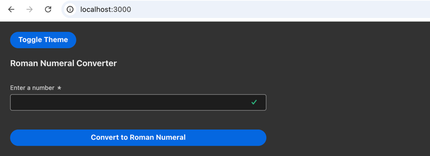

# genstudio-for-perf-mktng-engg-test

### Pre-requisites

* Java 17
* React
* Apache Maven 3.9.5 or above

### Framework Dependencies
* Using Spring Boot 3 as the Java backend to create the REST endpoint as it comes with embedded Tomcat server
* Spring Boot 3 is only supported from Java 17 to support optimization benefits
* Added Spring Web dependency in pom.xml for creating REST endpoints
```
    <dependency>
        <groupId>org.springframework.boot</groupId>
        <artifactId>spring-boot-starter-web</artifactId>
    </dependency>
```
* React App for the frontend
* Using Axios in React to invoke http requests to Spring Boot application
* React Spectrum libraries to leverage Adobe's design system


### Project creation process
* Created spring boot project using Spring Initializr https://start.spring.io/
* Created a react app using the command
    ```
    npx create-react-app react-frontend
    ```


### Project installation

* Install Java 17 and Apache Maven locally
* Validate by executing the following commands
    ```
  java -version
  mvn -version
  ```
* Output would look similar to below
    ```
    java version "17.0.12" 2024-07-16 LTS
    Java(TM) SE Runtime Environment (build 17.0.12+8-LTS-286)
    Java HotSpot(TM) 64-Bit Server VM (build 17.0.12+8-LTS-286, mixed mode, sharing)
  ```
  ```
    Java version: 17.0.12, vendor: Oracle Corporation, runtime: /Library/Java/JavaVirtualMachines/jdk-17.jdk/Contents/Home
    Default locale: en_US, platform encoding: UTF-8
    OS name: "mac os x", version: "14.5", arch: "aarch64", family: "mac"
    ```

* Navigate to the folder genstudio-for-perf-mktng-engg-test from a terminal and execute the below command to run the Spring boot application
    ```
  mvn spring-boot:run
    ```

* Below logs can be seen in the terminal
* 

* Above command will initialize Tomcat server on port 8080 and deploy the spring boot application
* Navigate to http://localhost:8080/ to ensure server is running

* Access the REST endpoint in the following format - http://localhost:8080/romannumeral?query=3432
* Navigate to the folder react-frontend in a different terminal. Install react libraries using the below commands. Before that, ensure npm is installed on your system
  ```
  npm install axios
  npm install @adobe/react-spectrum
  ```
* Run the react frontend using the below command
  ```
  npm start
  ```
* The frontend application will now be accessible via http://localhost:3000/
* Light Mode:

* Dark Mode:

